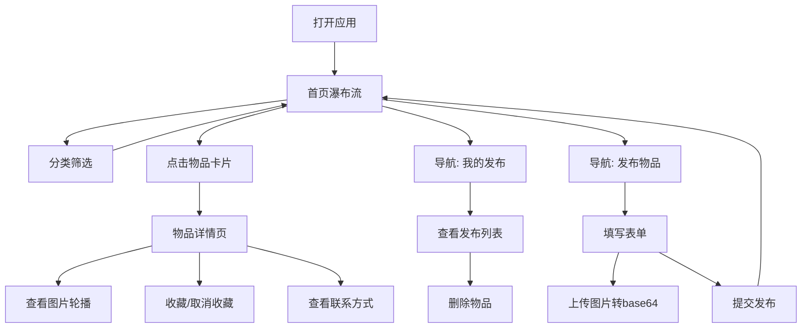

## 1. 产品概述

小区闲置物品互换平台，面向小区居民提供二手闲置物品的发布、浏览、互换服务。纯前端练手项目，数据存储于浏览器 localStorage，解决小区居民闲置物品流转不畅的问题。

## 2. 核心功能

### 2.1 用户角色

| 角色 | 注册方式 | 核心权限 |
|------|----------|----------|
| 普通用户 | 无需注册，本地模拟 | 浏览物品、发布物品、收藏、管理自己的发布 |

### 2.2 功能模块

1. **首页**：物品瀑布流展示、分类筛选（书籍/家电/童装/家具）
2. **物品详情页**：图片轮播、物品描述、发布人昵称和微信号、收藏按钮
3. **我的发布页**：自己发布的物品列表、删除功能
4. **发布物品页**：标题、分类、图片上传（转 base64）、描述、联系方式

### 2.3 页面详情

| 页面名称 | 模块名称 | 功能描述 |
|----------|----------|----------|
| 首页 | 分类筛选 | 左上角显示分类按钮（全部/书籍/家电/童装/家具），点击切换筛选 |
| 首页 | 物品瀑布流 | 两列瀑布流布局展示所有物品卡片，点击进入详情 |
| 物品详情页 | 图片轮播 | 支持多张图片左右滑动/切换展示 |
| 物品详情页 | 物品信息 | 展示标题、分类、描述、发布人昵称、微信号 |
| 物品详情页 | 收藏按钮 | 点击收藏/取消收藏，状态持久化 |
| 我的发布页 | 发布列表 | 展示当前用户发布的所有物品 |
| 我的发布页 | 删除功能 | 每条物品可删除，删除后无法恢复 |
| 发布物品页 | 表单 | 填写标题、选择分类、上传图片、写描述、留联系方式 |
| 发布物品页 | 图片上传 | 选择本地图片转为 base64 存储，支持多张 |
| 导航栏 | 页面跳转 | 首页、我的发布、发布物品三个入口 |

## 3. 核心流程

用户打开应用 → 浏览首页物品瀑布流 → 通过分类筛选缩小范围 → 点击感兴趣的物品进入详情页 → 查看物品信息与联系方式 → 可收藏物品或回到首页继续浏览。用户也可通过导航进入"发布物品"页填写信息发布新物品，或进入"我的发布"页管理已发布的物品。

## 4. 用户界面设计

### 4.1 设计风格

- **主色调**：暖橘色 (#FF8C42) 作为主题色，浅灰色 (#F5F5F5) 作为背景色
- **按钮风格**：圆角暖橘色填充按钮，hover 时颜色加深
- **字体**：思源黑体 (Noto Sans SC)，优先使用系统字体回退
- **布局风格**：卡片式布局，物品卡片 12px 圆角，带轻阴影
- **图标风格**：简洁线性图标

### 4.2 页面设计概览

| 页面名称 | 模块名称 | UI 元素 |
|----------|----------|----------|
| 首页 | 分类筛选 | 水平排列的分类标签，选中态暖橘色背景 |
| 首页 | 物品瀑布流 | 两列等宽，卡片间距 12px，图片自适应高度 |
| 物品详情页 | 图片轮播 | 全屏宽度，底部圆点指示器，左右切换按钮 |
| 物品详情页 | 收藏按钮 | 心形图标，未收藏空心，已收藏实心暖橘色 |
| 我的发布页 | 发布列表 | 列表布局，右侧显示删除按钮 |
| 发布物品页 | 表单 | 垂直排列表单项，上传区域虚线框提示 |
| 导航栏 | Tab 栏 | 底部固定导航，三个 Tab 切换 |

### 4.3 响应式设计

桌面端优先设计，移动端自适应。瀑布流在窄屏单列展示，宽屏两列展示。底部导航栏在移动端显示，桌面端可显示为顶部导航。
