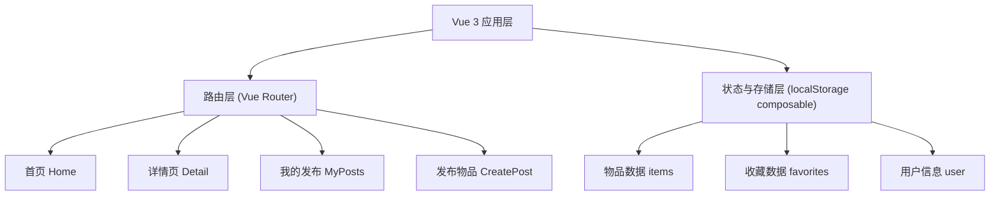
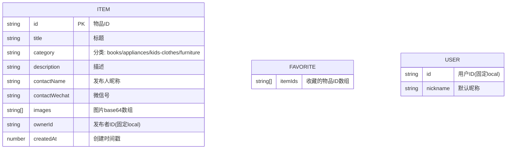

## 1. 架构设计



## 2. 技术说明

- **前端框架**：Vue 3 + TypeScript + Composition API (`<script setup>`)
- **构建工具**：Vite 5
- **样式方案**：Tailwind CSS 3
- **路由管理**：Vue Router 4
- **数据持久化**：浏览器 localStorage（封装为 composable）
- **初始化工具**：vite-init 使用 vue-ts 模板

## 3. 路由定义

| 路由路径 | 页面名称 | 说明 |
|----------|----------|------|
| `/` | 首页 | 物品瀑布流 + 分类筛选 |
| `/detail/:id` | 物品详情页 | 根据路由参数 id 从 localStorage 读取物品详情 |
| `/my-posts` | 我的发布页 | 当前用户发布的物品列表 |
| `/create` | 发布物品页 | 发布新物品表单 |

## 4. 数据模型

### 4.1 数据模型定义



### 4.2 localStorage 存储键

| 存储键 | 数据类型 | 说明 |
|--------|----------|------|
| `swap_items` | Item[] | 所有发布的物品数组 |
| `swap_favorites` | string[] | 收藏的物品 ID 数组 |
| `swap_user` | User | 当前用户信息 |

## 5. 项目目录结构

```
src/
├── components/          # 可复用组件
│   ├── ItemCard.vue     # 物品卡片组件
│   ├── ImageCarousel.vue # 图片轮播组件
│   ├── CategoryFilter.vue # 分类筛选组件
│   └── NavBar.vue       # 底部/顶部导航栏
├── composables/         # 组合式函数
│   ├── useStorage.ts    # localStorage 封装
│   └── useItems.ts      # 物品数据操作
├── pages/               # 页面组件
│   ├── Home.vue         # 首页
│   ├── Detail.vue       # 详情页
│   ├── MyPosts.vue      # 我的发布页
│   └── CreatePost.vue   # 发布物品页
├── types/               # TypeScript 类型定义
│   └── index.ts
├── router/              # 路由配置
│   └── index.ts
├── App.vue              # 根组件
├── main.ts              # 入口文件
└── style.css            # 全局样式与 Tailwind
```
